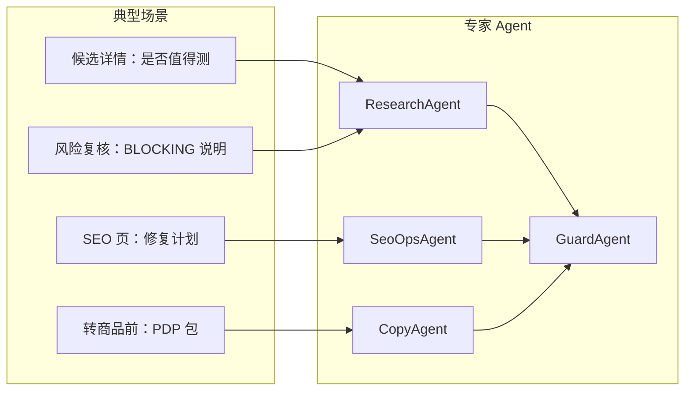
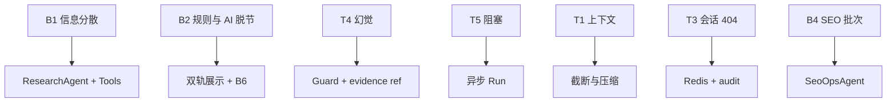
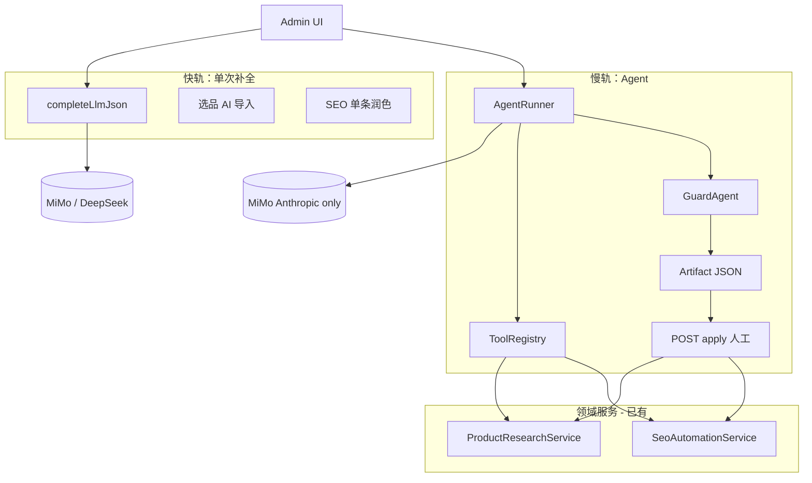
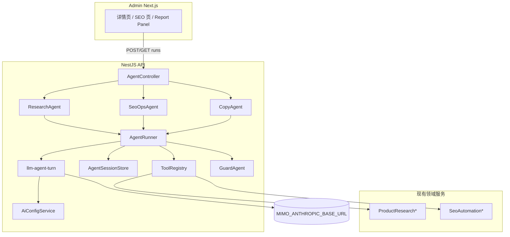
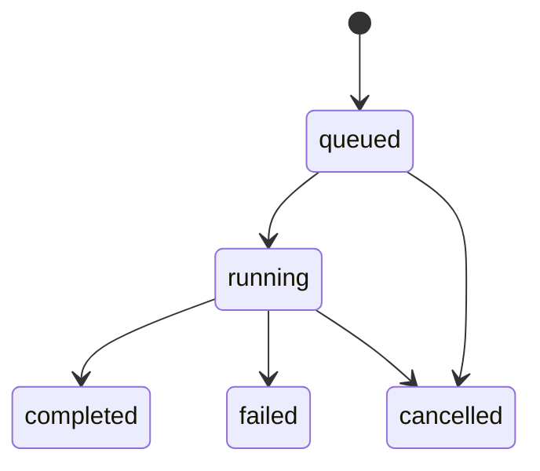

# Admin AI Agent 体系设计方案（完整版）

**项目**：PulseGear（HighFashion 仓库）  
**范围**：Admin 选品研究 + SEO 自动化（Phase 2 扩展内容与转商品）  
**状态**：设计稿（`api/src/ai/agent/` 未实现）  
**版本**：v2 — 痛点驱动整合版  
**关联**：[技术痛点深潜](./admin-ai-agent-technical-mitigations.md) | [现状能力](./admin-ai-capabilities.md) | [文档索引](./admin-ai-agent.md)

---

## 0. 文档怎么用

| 读者 | 建议阅读 |
|------|----------|
| 产品 / 运营 | §2 场景、§3 痛点表、§12 前端、§15 路线、§16 ROI |
| 后端 | §5–§11、§14、附录目录结构 |
| 全员 | §1 摘要、§4 目标、§17 风险 |

技术实现细节（截断算法、Redis 字段、测试夹具）仍以 [admin-ai-agent-technical-mitigations.md](./admin-ai-agent-technical-mitigations.md) 为 **Phase 0 检查清单**；本文把痛点与方案**一一对应**，避免设计与对策两张皮。

---

## 1. 执行摘要

### 1.1 我们要做什么

在已上线的 **`completeLlmJson` 单次补全**（选品批量生成、SEO 草稿润色）之上，增加 **薄编排 Agent 层**：

- 通过 **白名单 Tool** 按需拉取候选/SEO 真实数据；
- 多步推理后输出 **固定 JSON 报告**（证据链 + 建议动作）；
- **人工 Apply** 后才写 note、创建 SEO DRAFT、触发入队重算等副作用。

### 1.2 不做什么

- 不自动 Approve / Publish / 转商品上架 / 下单；
- 不用 Agent 替代规则评分引擎；
- 不引入 Job 表（长任务：`setImmediate` + 进程内队列 + 可选 Redis 会话）；
- 不做前台客服聊天主界面。

### 1.3 核心结论（选型）

| 维度 | 决策 |
|------|------|
| LLM | Agent **仅** MiMo Token Plan **Anthropic Messages**（`tool_use`）；补全可继续 DeepSeek / MiMo 双协议 |
| 框架 | 自研 `AgentRunner` + `ToolRegistry`（约 800–1200 行核心），不引入 LangChain |
| 编排 | MVP：**UI 直连专家 Agent**；Phase 2 再加 Orchestrator |
| 会话 | dev 内存 Map；生产 Redis + `auditLog` 终态兜底 |
| 写库 | 仅 `propose_*` / `enqueue_*`；Apply 独立 API + 再跑 Guard |

---

## 2. 角色与典型场景

### 2.1 角色

| 角色 | 目标 | 当前摩擦 |
|------|------|----------|
| **选品分析师** | 判断 SKU 是否值得 SAMPLE/TEST | 详情页 Tab 多、分数/信号/风险/报价分散；AI 导入与规则分脱节 |
| **SEO 运营** | 修复 health issues、排期 Brief | 健康检查与推荐列表长；改一条用补全，改一批缺计划 |
| **内容编辑** | PDP / Guide 草稿 | 转商品前需自己拼字段；语气不统一 |
| **管理员** | 审计、控成本、防合规事故 | LLM 不可追溯；怕 AI 编造 GSC/评价 |

### 2.2 场景 → Agent 映射



| 场景 | 触发（MVP） | Agent | 产出 |
|------|-------------|-------|------|
| 深度调研 | 候选详情「生成调研报告」 | Research | 证据 + `ruleRecommendedAction` vs `aiSuggestedAction` |
| 风险说明 | 风险页「AI 解读」（Phase 1） | Research | 未 resolve 项 + 缓解建议（只读） |
| SEO 批次修复 | SEO 工作台「生成修复计划」 | SeoOps | 按 issue 分组的 `proposals[]`（DRAFT） |
| 转商品文案 | 转商品向导「生成 PDP 草稿」 | Copy | 标题/卖点/FAQ 草案 → 人审后 convert |

---

## 3. 痛点全景与对策（核心章节）

下列痛点来自：**现状代码**（[admin-ai-capabilities.md](./admin-ai-capabilities.md)）、**选品/SEO 产品形态**、**已踩过的技术坑**（MiMo 双端点、多副本会话、Prisma 迁移等）。

### 3.1 痛点—对策总表

| ID | 类型 | 痛点 | 现状表现 | 根因 | 设计对策 | 阶段 |
|----|------|------|----------|------|----------|------|
| **B1** | 业务 | 决策信息分散 | 分析师在 scores / signals / risks / quotes 间来回切 Tab | 单次补全无法按需取数 | ResearchAgent + 只读 Tools 聚合；报告固定 schema | P0 |
| **B2** | 业务 | AI 导入与规则分脱节 | 批量生成候选后，仍靠人脑对齐规则 REJECT/APPROVE | 生成与评估是两个系统 | 报告强制展示 **规则分 + 规则推荐动作**（DB tool）与 **AI 建议** 并排 | P0 |
| **B3** | 业务 | 市场信号不可信 | `collectSignals` 为 local mock，易被误当真实趋势 | 无真实 GSC/Trends 接入 | Tool 返回带 `source`；mock 标 `source: mock`；报告写「未接入真实数据源」 | P0 |
| **B4** | 业务 | SEO 改一条快、改一批慢 | 单条 recommendation 润色已有；全站修复靠人工排 | 缺「计划」层产物 | SeoOpsAgent 输出分组 `proposals`，人逐条 Apply | P1 |
| **B5** | 业务 | 转商品文案成本高 | convert 前需手写 PDP 字段 | Copy 未接入 | CopyAgent 草稿 + 现有 convert API（仍 DRAFT） | P2 |
| **B6** | 业务 | 新人不知信谁 | 规则 REJECT 但 AI 写 APPROVE | 无冲突 UX | `disagreementReason` + 黄色 banner；禁止自动 decision | P0 |
| **O1** | 运营 | 重算耗时长、页面假死 | `bulkRecalculate` 已后台化，但详情仍易重复点 | 用户以为同步完成 | Tool 仅 `enqueue_recalculate`；报告写「已排队，见 assessment-runtime」 | P0 |
| **O2** | 运营 | 无证据不敢拍板 | 只有分数数字，无理由链 | 补全无 tool trace | `evidence[]` 带 `ref` + `toolCallId`；UI 可折叠 Trace | P0 |
| **O3** | 运营 | Apply 误点 | SEO 误发布错误 meta | 缺 diff 预览 | `GET artifacts/:id` 预览 diff；Apply 再 Guard | P1 |
| **T1** | 技术 | 上下文/token 爆炸 | 多轮 tool 后费用高、变慢 | 全量 messages 堆积 | 工具结果截断 + `compactMessages` + `maxSteps`/`maxTokens` | P0 |
| **T2** | 技术 | MiMo 双端点 401 | Token Plan Key 不能打官方 OpenAI 路径 | 密钥与 URL 绑定不同协议 | Agent **仅** Anthropic；`npm run test:mimo` + `capabilities.agent` | P0 |
| **T3** | 技术 | 多副本 Run 404 | POST 在 A，GET 在 B | 内存 Session | Redis + audit 兜底 | P1 上生产 |
| **T4** | 技术 | 幻觉数据 | 报告编造 GSC 涨幅、分数 | 模型补全空白 | Tool 必填 `source`/`id`；Guard 校验 `evidence.ref` | P0 |
| **T5** | 技术 | 长 Run 阻塞 | 60s+ 占事件循环 | 同步 await Agent | `setImmediate` 异步 Run + 并发上限 3 + 90s 总超时 | P0 |
| **T6** | 技术 | 轮询像卡死 | 无进度 | 无 SSE | `step`/`lastTool` 字段；45s 提示可离开 | P0 |
| **T7** | 技术 | 契约漂移 | 前后端字段不一致 | 手写 fetch | Agent API 进 OpenAPI + `adminOpenApiFetch` | P1 |
| **T8** | 技术 | 合规/虚假宣传 | 医疗宣称、假评价 | 仅 prompt 约束 | Guard 规则 + Apply 再审；对齐 AGENTS.md | P0 |
| **T9** | 技术 | CI 不稳定 | 真模型波动 | 依赖外网 | PR 只 mock fetch；`test:mimo` 手动/nightly | P0 |

### 3.2 痛点关系（优先解决顺序）



**Phase 0 必须闭环**：B1、B2、B6、O1、O2、T1、T2、T4、T5、T6、T8、T9。  
**上多副本生产前必须**：T3。  
**Phase 1+**：B4、O3、T7、B3（真实数据源按 Tool 逐步替换 mock）。

---

## 4. 目标、非目标与成功指标

### 4.1 目标

| 目标 | 度量（上线后 4–8 周） |
|------|----------------------|
| 缩短单候选调研时间 | 详情页停留时长 ↓30%（埋点） |
| 降低漏看 BLOCKING 风险 | 转商品前未 resolve 拦截率维持 100% |
| 提高 SEO 批次处理吞吐 | 每轮 health check 后人工 Apply 条数 ↑ |
| 可审计 | 100% Run 写 `auditLog`；artifact 可追溯到 tool trace |

### 4.2 非目标

见 §1.2；另：**不**用 Agent 跑全库批量（批量仍用 `completeLlmJson` + 队列）。

### 4.3 与项目硬约束对齐

| 约束 | Agent 遵守方式 |
|------|----------------|
| 无 Job 表 | Run 状态在 Redis/内存；重算走 `enqueueCandidateAssessments` |
| Admin only | `AdminRoles` + Tool 级鉴权 |
| 不伪造 SEO 数据 | Guard + Tool `source` 标注 |
| OpenAPI 契约 | Phase 1 纳入 `admin-domains.json` |

---

## 5. 解决方案总览

### 5.1 双轨架构



### 5.2 何时用哪条轨

| 用 `completeLlmJson`（保持） | 用 Agent（新增） |
|------------------------------|------------------|
| AI 导入预览生成 N 条候选 | 单候选深度调研报告 |
| SEO 单条 recommendation / brief 润色 | 健康检查 → 全站修复**计划** |
| 商品 SEO 字段单次改写 | 转商品全 PDP 包 + Guard |
| 低延迟、可预测 schema | 需 3+ 次取数、证据链、提案工作流 |

---

## 6. 总体架构



### 6.1 模块职责

| 模块 | 职责 | 对应痛点 |
|------|------|----------|
| `AgentController` | 鉴权、创建/查询/取消 Run、Apply | T5、T6、T7 |
| `AgentRunner` | 步进循环、预算、超时、降级、消息压缩 | T1、T5 |
| `ToolRegistry` | Schema、角色鉴权、执行、截断 | T4、B1 |
| `AgentSessionStore` | Map / Redis | T3、T6 |
| `GuardAgent` | 规则 + 轻量二审 | T4、T8、B6 |
| `ResearchAgent` | 选品 prompt + tools + 终态 schema | B1–B3、O1–O2 |
| `SeoOpsAgent` | SEO 计划 + tools | B4、O3 |
| `CopyAgent` | PDP 草稿（可调 `completeLlmJson`） | B5 |

### 6.2 与现有异步的关系

| 系统 | 用途 | Agent 交互 |
|------|------|------------|
| `enqueueCandidateAssessments` | 确定性评分重算 | Tool `enqueue_recalculate`，**禁止** await 完成 |
| `AgentRunner` | 非确定性调研 | 独立并发池，`maxConcurrentAgentRuns=3` |

---

## 7. 多 Agent 规格

### 7.1 ResearchAgent（P0）

**System 约束（摘要）**：

- 只能引用 Tool 返回的数据写 `evidence`；无数据写「未采集」。
- 不得编造分数、信号、GSC、库存。
- 不得调用任何写 decision / convert / 改分的 Tool。

**Tools（MVP）**：

| Tool | 类型 | 说明 |
|------|------|------|
| `get_candidate_detail` | 读 | 摘要 + 当前规则推荐动作 |
| `list_candidate_scores` | 读 | 分页截断 ≤5 条 |
| `list_candidate_signals` | 读 | 分页截断 ≤8 条；mock 标 source |
| `list_open_risk_flags` | 读 | 含 severity / blocking |
| `get_supplier_quotes` | 读 | 报价摘要 only |
| `enqueue_recalculate` | 副作用 | 入队，返回 `{ queued: true }` |
| `append_candidate_note` | 提案 | 仅 Apply 后写入 |

**终态 Schema**：

```json
{
  "executiveSummary": "string",
  "ruleRecommendedAction": "SAMPLE|TEST|WATCH|REJECT|APPROVE",
  "aiSuggestedAction": "SAMPLE|TEST|WATCH|REJECT|APPROVE",
  "confidence": "high|medium|low",
  "disagreementReason": "string|null",
  "evidence": [
    {
      "ref": "tool_2.scores[0]",
      "toolCallId": "uuid",
      "source": "db:product_research_score",
      "finding": "string"
    }
  ],
  "risks": [{ "severity": "string", "mitigation": "string" }],
  "nextSteps": ["string"],
  "needsHumanReview": false
}
```

**UI（对应 B2、B6、O2）**：

- 顶部：规则推荐 vs AI 建议；不一致 → 黄色 banner。
- 中部：Executive summary + evidence 列表（可展开 trace）。
- 底部：「将 note 写入候选」→ Apply；**不**提供一键 Approve。

### 7.2 SeoOpsAgent（P1）

**Tools**：`run_health_check`、`list_seo_issues`、`list_opportunities`、`propose_seo_patch`（仅 DRAFT）等。  
**禁止**：`apply_recommendation`、`publish_brief`。

**终态（示意）**：

```json
{
  "summary": "string",
  "groups": [
    {
      "issueType": "missing_meta_description",
      "count": 12,
      "proposals": [
        { "entityType": "product", "entityId": "...", "patchPreview": {}, "priority": "high" }
      ]
    }
  ],
  "needsHumanReview": false
}
```

### 7.3 CopyAgent（P2）

- 输入：候选 + 目标 collection / 场景（Run `options`）。
- 内部可调用 `completeLlmJson` 生成结构化 PDP 字段。
- 输出进 Guard 后供转商品向导粘贴/确认。

### 7.4 GuardAgent（P0 规则层，P1 可选 LLM）

| 检查 | 失败处理 |
|------|----------|
| 终态 JSON Zod 校验 | fallback 模板 + `needsHumanReview: true` |
| `evidence.ref` 映射 trace | 同上 |
| 禁词表（医疗、#1、假评价等） | 阻断 Apply |
| SEO：无 fake stock/review | 对齐 AGENTS.md |

---

## 8. 运行循环与韧性

```
maxSteps = 6 (Research) / 8 (SeoOps)
maxTokens = 12_000
wallClock = 90_000 ms
maxConcurrentRuns = 3

POST /runs → { runId, status: "queued" }
setImmediate(() => runner.execute(runId))

loop:
  response = anthropicMessages(messages, tools, thinking: disabled)
  if end_turn && validFinalJson:
    return guard.validate(artifact)
  if tool_use:
    for each tool:
      assert registry.allowed(role, tool)
      result = race(registry.execute(), 5s timeout)
      messages.append(truncate(result))
    compactMessages()  // 保留 system + 首轮 user + 最近 2 轮 tool
  if overBudget: inject "必须本轮输出终态 JSON"

on failure: completeLlmJson(singleShot) || localTemplate
on complete: auditLog + session.patch(completed, artifact)
```

详细参数见 [technical-mitigations §1–§6](./admin-ai-agent-technical-mitigations.md)。

---

## 9. API、数据与权限

### 9.1 REST（建议）

Base：`/api/admin/agents`

| 方法 | 路径 | 说明 |
|------|------|------|
| POST | `/runs` | `{ agentType, entityId, options? }` → `{ runId, status }` |
| GET | `/runs/:id` | 进度 + artifact + trace（可选 `?compact=1`） |
| POST | `/runs/:id/cancel` | 取消 |
| GET | `/artifacts/:id` | 预览 diff（SEO patch） |
| POST | `/artifacts/:id/apply` | 人工确认 + Guard 再审 |
| GET | `/runtime` | 活跃 Run、拒绝次数（运维） |

### 9.2 Run 状态机



### 9.3 权限矩阵

| Agent | 最低 AdminRole | Apply |
|-------|----------------|-------|
| research | ANALYST | note：ANALYST；decision 仍走原 API + ADMIN |
| seo_ops | CONTENT_EDITOR | 与原 SEO Apply 一致 |
| copy | OPERATOR | convert 仍 ADMIN 流程 |

### 9.4 持久化策略

| 数据 | 存储 | TTL | 痛点 |
|------|------|-----|------|
| 进行中 Run | Redis `agent:run:{id}` | 1h | T3 |
| 完成 artifact | `auditLog.details` | 永久 | T3、O2 |
| Trace 全文 | audit 或 Redis 可选 | 7d | 成本 |

---

## 10. 前端体验（痛点驱动）

### 10.1 组件

`components/admin/admin-agent-report-panel.tsx`（计划）：

| 元素 | 解决痛点 |
|------|----------|
| 进度条 `step / maxSteps` + `lastTool` | T6 |
| 45s 文案「可离开页面，完成后通知」 | T6 |
| 规则 vs AI 双栏 | B2、B6 |
| 可折叠 Tool Trace | O2、T4 |
| Apply 前 diff 模态 | O3 |
| 失败：展示 fallback 原因 + 重试 | T2、T9 |

### 10.2 入口（MVP 无聊天）

- 候选详情：**生成调研报告**
- SEO 工作台：**生成修复计划**
- 转商品向导（P2）：**生成 PDP 草稿**

Phase 2 可选：自然语言框 → Orchestrator。

---

## 11. 可观测性与 SLO

| 信号 | 说明 | 告警建议 |
|------|------|----------|
| `x-request-id` | 贯穿 Run | 已有 interceptor |
| `agent_run_duration_ms` | p95 < 75s | 超则降 maxSteps |
| `agent_run_failed_total` | 含 MiMo 4xx/5xx | 率 > 20% |
| `agent_fallback_total` | schema/Guard | 突增查 prompt |
| `agent_tool_timeout_total` | 单 tool > 5s | 优化 DB 查询 |
| `agent_concurrent_rejected` | 429 | 提示排队 |

`auditLog.action` 示例：`AGENT_RESEARCH_REPORT`、`AGENT_SEO_PLAN`、`AGENT_APPLY_NOTE`。

---

## 12. 分阶段实施路线

### Phase 0（1–2 周）— 可内测

**目标**：ResearchAgent 闭环，解决 B1/B2/B6/O1/O2 与 T1/T2/T4/T5/T6/T8/T9。

| 任务 | DoD |
|------|-----|
| `llm-agent-turn.ts` | Anthropic tool loop；`thinking: disabled` |
| `AgentRunner` + `ToolRegistry` + 内存 Session | 6 步 fixture < 80KB |
| ResearchAgent 6 只读 tools + note 提案 | Zod 终态；Guard ref 校验 |
| API POST/GET/cancel runs | 异步；并发 3；90s 超时 |
| 候选详情 Report Panel | 双轨展示 + trace |
| auditLog | 完成可搜 runId |
| 测试 | Runner mock fetch；不进真模型 PR |

### Phase 1（2–3 周）— 可多副本生产

| 任务 | DoD |
|------|-----|
| Redis Session + audit 兜底 | 双实例 GET 不 404 |
| SeoOpsAgent + `propose_seo_patch` | 计划 JSON + diff 预览 |
| OpenAPI + `adminOpenApiFetch` | `openapi:check` 通过 |
| `GET /runtime` | 运维可见活跃 Run |

### Phase 2（按需）

- CopyAgent + 转商品提案流  
- Orchestrator + NL 入口  
- SSE（`step_started` / `tool_finished` / `completed`）  
- 真实 GSC/GA4/Trends Tools 替换 mock（B3）  
- Run 配额看板、浏览器 Notification  

---

## 13. 成本、ROI 与风险

### 13.1 成本

| 项 | 估算 |
|----|------|
| LLM | 单次 Agent Run ≈ 单次补全的 **3–8×** token |
| 工程 | Phase 0 约 1–2 人周（含测试） |
| 运维 | Redis（多副本）；MiMo 额度监控 |

### 13.2 ROI（定性）

- 分析师：少 15–30 分钟/候选的信息拼装（待埋点验证）。  
- SEO：批次 issue 分组减少漏改。  
- 合规：Guard 降低虚假宣传事故概率。

### 13.3 风险登记册

| 风险 | 可能性 | 影响 | 缓解 |
|------|--------|------|------|
| 劣质 SKU 因 AI 话术通过 | 中 | 高 | 规则分 + BLOCKING + 人工 decision |
| 幻觉进报告 | 中 | 中 | Tool source + Guard ref |
| MiMo 不可用 | 低 | 中 | fallback 模板 + `agentCapable=false` |
| 成本失控 | 中 | 中 | 并发上限 + token 预算 + fast 模型 Guard |
| 多副本 404 | 高（若未做 P1） | 中 | Redis 再上生产 |

---

## 14. 与产品路线图衔接

| 规划能力 | Agent 承接 |
|----------|------------|
| 真实 GSC/GA4/Trends | `collect_*` Tools，替换 mock |
| 1688 enrichment | Research 子 tool 链 |
| Convert to Product | CopyAgent 草稿 → 现有 convert API |
| 评分规则激活全量重算 | 仍 `enqueueCandidateAssessments`，Agent 不替代 |

---

## 15. 决策摘要

1. **痛点优先**：P0 聚焦「信息聚合 + 证据链 + 规则/AI 双轨 + 异步不阻塞 + 防幻觉」。  
2. **双轨共存**：补全做批量与单条润色；Agent 做深度调研与批次计划。  
3. **薄编排自研**：Tool 白名单、硬预算、Guard、无 Job 表。  
4. **MiMo Anthropic only** for Agent；技术清单见 [mitigations](./admin-ai-agent-technical-mitigations.md)。

---

## 16. 附录

### 16.1 计划目录结构

```text
api/src/ai/
  ai-config.service.ts
  llm-json-completion.ts
  llm-agent-turn.ts
  agent/
    agent.module.ts
    agent.controller.ts
    agent-runner.ts
    agent-session.store.ts
    tool-registry.ts
    guard.service.ts
    agents/
      research.agent.ts
      seo-ops.agent.ts
      copy.agent.ts
    tools/
      research.tools.ts
      seo.tools.ts
    types/
      agent-run.types.ts

components/admin/
  admin-agent-report-panel.tsx
```

### 16.2 环境变量

见 [technical-mitigations §15](./admin-ai-agent-technical-mitigations.md) 与 [external-config.md](./external-config.md)。

### 16.3 修订记录

| 日期 | 版本 | 说明 |
|------|------|------|
| 2026-05-27 | v1 | 初版设计方案 |
| 2026-05-27 | v2 | 整合业务/运营/技术痛点矩阵、场景、SLO、DoD |
