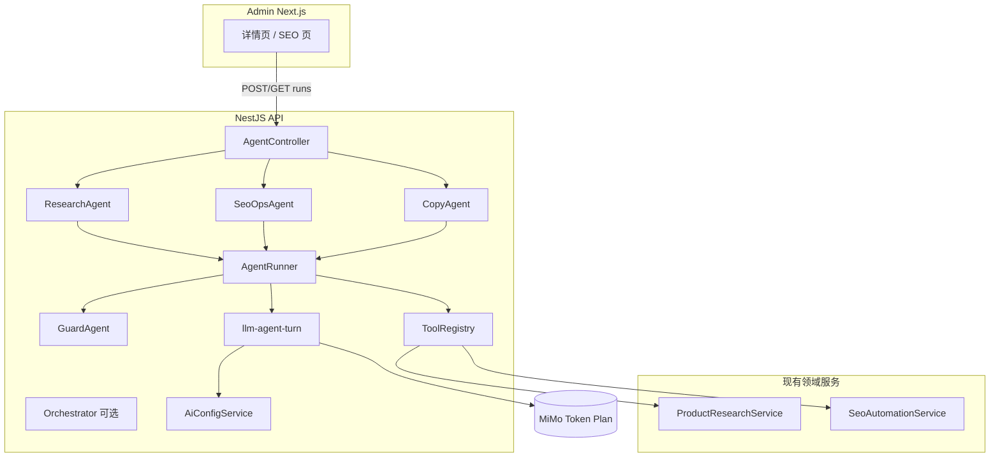
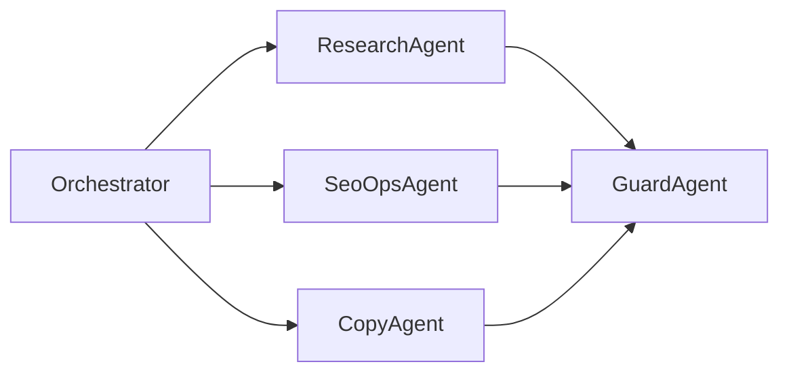

# Admin AI Agent 体系设计方案

**项目**：PulseGear（HighFashion 仓库）  
**范围**：Admin 选品研究 + SEO 自动化（可扩展至内容与转商品）  
**状态**：设计稿（Phase 0 未实现）  
**关联**：[技术痛点与优化](./admin-ai-agent-technical-mitigations.md) | [现状能力](./admin-ai-capabilities.md)

---

## 1. 摘要

在保留现有 **`completeLlmJson` 单次补全** 的前提下，新增 **薄编排 Agent 层**：通过白名单 Tool 多步取数、推理、输出固定 JSON 报告；**人工 Apply** 后才执行写库/发版。

**核心原则**：

1. 双轨：简单改写继续补全；复杂调研走 Agent。  
2. Tool 优先于自由文本；写操作仅 `propose_*` + 人确认。  
3. 无 Job 表；Run 异步 + 内存/Redis 会话 + `auditLog` 持久化结论。  
4. MiMo Token Plan Anthropic 为 Agent 主通道。

---

## 2. 背景与问题

### 2.1 现状基线

见 [admin-ai-capabilities.md](./admin-ai-capabilities.md)。

### 2.2 单次补全的局限

| 擅长 | 不擅长 |
|------|--------|
| 固定 schema 的文案/列表生成 | 按需拉取多表数据 |
| 低延迟、低成本 | 多步推理与证据链 |
| 确定性高 | 跨模块编排（选品→SEO→转商品） |

### 2.3 Agent 要解决的问题

- 候选详情页：**一份调研报告**（证据 + 建议动作 + 与规则分对照）。  
- SEO 页：**修复计划草案**（按 issue 分组，不自动 Apply）。  
- 可审计、可降级、符合 AGENTS.md / SEO 规则（不伪造评价、库存、医疗宣称）。

---

## 3. 目标与非目标

### 3.1 目标

- 缩短选品/SEO 决策时间（目标 30–50%，需上线后度量）。  
- 强制拉齐风险、分数、供应商、信号（通过 Tool，减少漏看）。  
- 提案 → 确认工作流，与 `decision` / `seoChangeLog` 对齐。  
- 与现有 `AiConfigService`、`AdminRoles`、OpenAPI 契约一致。

### 3.2 非目标

- 前台商城对话客服。  
- Agent 自动 Approve、自动 Publish、自动转商品上架。  
- 引入 Job 表做调度（继续进程内队列 + 可选 Redis）。  
- 用 Agent 替代规则评分引擎（规则分仍为准入依据）。

---

## 4. 选型建议

### 4.1 LLM 与协议

| 选项 | 角色 | 说明 |
|------|------|------|
| **MiMo + Anthropic Messages** | Agent **主路径** | `MIMO_ANTHROPIC_BASE_URL` + `/v1/messages`；支持 `tool_use` / `tool_result` |
| MiMo OpenAI 兼容 | 备用 / 补全 | Token Plan Key 在官方 `/v1/chat/completions` 常 401 |
| DeepSeek OpenAI 兼容 | SEO/选品补全 + 备用 | 已接；Agent tool calling 需单独验证 |
| OpenAI | Phase 2+ | 配置槽位有，无实现 |
| Local | 兜底 | 模板；Agent 失败或超时时降级 |

**实现**：扩展 `llm-json-completion` 为 `llm-agent-turn.ts`（仅 Anthropic 多轮）；补全逻辑不变。

### 4.2 Agent 框架

| 方案 | 建议 |
|------|------|
| **自研薄编排（推荐）** | `api/src/ai/agent/`：Runner + Registry + 专家 Agent |
| LangGraph / LangChain | 不采纳（依赖重、与「少依赖」冲突） |
| Vercel AI SDK | 不采纳（核心在 Nest API） |
| Cursor SDK | 仅研发自动化，非站内功能 |

预估核心代码 **800–1200 行**（不含 Tool 业务实现）。

### 4.3 会话存储

| 环境 | 方案 |
|------|------|
| 本地 dev | `Map<runId, AgentSession>` |
| 生产多副本 | **Redis**（`agent:run:{id}`，TTL 1h） |
| 已完成 Run 兜底 | `auditLog.details` 存终态 artifact（Redis 过期后可查） |

### 4.4 前端交互

| 模式 | 场景 |
|------|------|
| 异步 + 轮询（MVP） | `POST /runs` → `GET /runs/:id` 每 2s |
| 同步（可选） | ≤6 步、90s 内的轻量报告 |
| SSE（Phase 2） | 推送 `step` / `lastTool`，非必须 |

UI：**报告卡片 + 可折叠 Trace**；不做聊天窗口主界面。

---

## 5. 总体架构



### 5.1 模块职责

| 模块 | 职责 |
|------|------|
| `AgentController` | 鉴权、创建/查询/取消 Run、Apply 提案 |
| `AgentRunner` | 步进循环、预算、超时、降级 |
| `ToolRegistry` | Schema、AdminRole 鉴权、执行、结果截断 |
| `ResearchAgent` | 选品调研 prompt + tools + 输出 schema |
| `SeoOpsAgent` | SEO 修复计划 + tools |
| `CopyAgent` | PDP/FAQ 草稿（可调 `completeLlmJson`） |
| `GuardAgent` | 规则 + 轻量 LLM 二审 |
| `OrchestratorAgent` | Phase 2：意图路由；MVP 由 UI 直连专家 Agent |

### 5.2 与现有异步的关系

| 系统 | 用途 |
|------|------|
| `enqueueCandidateAssessments` | 确定性重算评分 |
| `AgentRunner` | 非确定性调研/建议 |

Agent **不得**同步等待 `refreshCandidateAssessment`；仅 `enqueue_recalculate` 并报告「已排队」。

---

## 6. 多 Agent 设计

### 6.1 为何多 Agent

- 单 Agent 工具列表过长 → 选错 tool。  
- 分领域短 prompt → 降 token。  
- 按 `AdminRoles` 限制可调 Agent。  
- Phase 2 可并行子任务。

### 6.2 角色定义



#### ResearchAgent（选品调研）

- **入口**：候选详情「AI 调研报告」；风险复核页（Phase 2）。  
- **Tools（示例）**：
  - `get_candidate_detail`
  - `list_candidate_scores` / `list_candidate_signals`
  - `list_open_risk_flags`
  - `get_supplier_quotes`
  - `enqueue_recalculate`（入队，不等待）
  - `append_candidate_note`（草稿 note，非 decision）
- **禁止**：`create_decision`、`convert_to_product`、`update_score`

**终态 Schema**：

```json
{
  "executiveSummary": "string",
  "ruleRecommendedAction": "SAMPLE|TEST|...",
  "aiSuggestedAction": "SAMPLE|TEST|WATCH|REJECT|APPROVE",
  "confidence": "high|medium|low",
  "disagreementReason": "string|null",
  "evidence": [
    { "ref": "tool_2.scores[0]", "source": "db", "finding": "string" }
  ],
  "risks": [{ "severity": "string", "mitigation": "string" }],
  "nextSteps": ["string"]
}
```

#### SeoOpsAgent（SEO 运营）

- **Tools**：`run_health_check`、`list_seo_issues`、`list_opportunities`、`propose_seo_patch`（DRAFT only）等。  
- **禁止**：`apply_recommendation`、`publish_brief`。

#### CopyAgent（文案）

- 转商品 PDP 包、Guide 大纲；内部可调用 `completeLlmJson`。  
- 输出供人审后走现有 convert / content API。

#### GuardAgent（合规）

- 输入：任一 Agent 终态。  
- 规则：AGENTS.md + SEO 规则（禁止 fake reviews/ratings/stock/医疗宣称）。  
- 失败：`needsHumanReview: true`，不展示为「可一键 Apply」。

### 6.3 MVP 编排策略

**不做**自动 Orchestrator 意图分类；Admin UI 三个按钮直连：

- 「生成调研报告」→ ResearchAgent  
- 「生成 SEO 修复计划」→ SeoOpsAgent  
- 「生成 PDP 草稿」→ CopyAgent  

Phase 2 再增加自然语言入口与 Orchestrator。

---

## 7. Agent 运行循环

```
maxSteps = 6..8
maxTokens = 12_000
wallClock = 90s

messages = [system, userGoal]

for step in 1..maxSteps:
  response = anthropicMessages(messages, tools=agentToolSubset)
  if end_turn and validFinalJson(response):
    guarded = guard.validate(response)
    return guarded
  if tool_use:
    for tool in tool_use:
      assert registry.allowed(role, tool)
      result = registry.execute(tool, actor)  // truncated
      messages.append(tool_result)
  if overBudget: forceFinalJson()

return fallback(singleShotJson) or localTemplate
```

详见 [技术优化方案](./admin-ai-agent-technical-mitigations.md)。

---

## 8. API 契约（建议）

Base：`/api/admin/agents`

| 方法 | 路径 | 说明 |
|------|------|------|
| POST | `/runs` | `{ agentType, entityId, options? }` → `{ runId, status }` |
| GET | `/runs/:id` | `{ status, step, maxSteps, lastTool, artifact?, trace? }` |
| POST | `/runs/:id/cancel` | 取消 |
| POST | `/artifacts/:id/apply` | 人工确认后执行（写 note / 创建 SEO DRAFT 等） |

纳入 `admin-domains.json` OpenAPI 生成；前端 `adminOpenApiFetch`。

### 8.1 权限矩阵

| Agent | 最低 AdminRole |
|-------|----------------|
| research | ANALYST |
| seo_ops | CONTENT_EDITOR |
| copy | OPERATOR |
| apply artifact | 与原模块一致（常 ADMIN） |

---

## 9. 可观测性

| 信号 | 存储/展示 |
|------|-----------|
| `x-request-id` | 贯穿 Run（已有 interceptor） |
| Run 指标 | step、tool 名、耗时、token 累计 |
| 业务审计 | `auditLog.action` 如 `AGENT_RESEARCH_REPORT` |
| 运行时 | 可选 `GET /admin/agents/runtime`（活跃 Run 数、队列拒绝次数） |
| 日志 | `Logger.warn`：截断、解析失败、Guard 拒绝、fallback |

---

## 10. 与单次补全的边界

| 继续 `completeLlmJson` | 使用 Agent |
|------------------------|------------|
| SEO 单条 recommendation 润色 | 健康检查 → 全站修复计划 |
| AI 导入生成 N 条候选 | 单候选深度调研 |
| Brief 改标题/大纲 | GSC 机会 → Brief → 内链提案链 |
| 商品 SEO 字段单次改写 | 转商品全 PDP + Guard |

---

## 11. 分阶段实施路线

### Phase 0（1–2 周）

- [ ] `llm-agent-turn.ts`（Anthropic tools）  
- [ ] `AgentRunner` + `ToolRegistry` + 内存 session  
- [ ] ResearchAgent MVP（4–6 只读 tools + 终态 schema）  
- [ ] API POST/GET runs；候选详情页报告 UI  
- [ ] auditLog；步数/token/超时  
- [ ] Guard 规则层（基础禁词 + schema 校验）

### Phase 1（2–3 周）

- [ ] SeoOpsAgent + `propose_seo_patch`  
- [ ] Redis session（多副本时）  
- [ ] OpenAPI + `admin-api` 类型  
- [ ] `GET artifacts` 预览 diff

### Phase 2（按需）

- [ ] CopyAgent + 转商品提案流  
- [ ] Orchestrator + 自然语言入口  
- [ ] SSE 进度  
- [ ] 并行子 Agent、Run 配额看板

---

## 12. 业务影响

### 12.1 正面

| 领域 | 影响 |
|------|------|
| 选品 | 报告 + 证据链，减少漏看风险与供应商维度 |
| SEO | 可执行草案，仍人控 Apply |
| 培训 | audit + 报告降低新人成本 |
| 品牌 | Guard + CopyAgent 统一语气 |

### 12.2 成本

| 项 | 说明 |
|----|------|
| LLM | Agent 单次约为补全的 **3–8×** token |
| 人力 | 初级处理量↑，高级审核提案 |
| 流程 | 明确「提案 → 确认」 |

### 12.3 风险与缓解

| 风险 | 缓解 |
|------|------|
| 劣质 SKU 因 AI 通过 | 规则分 + 人工 decision 为准 |
| 错误 Apply SEO | diff 预览 + change-log |
| 虚假宣传 | Guard + 禁止编造 reviews/stock |
| 数据泄露 | Tool 按 entityId  scoped |

### 12.4 与 product-research 路线图

| 规划项 | Agent 承接方式 |
|--------|----------------|
| 真实 GSC/GA4/Trends | 作为 Tool 注入 Research/SeoOps |
| 1688 enrichment | Research 子 tool 链 |
| Convert to Product | CopyAgent 草稿 + 人确认 → 现有 convert API |

---

## 13. 决策摘要

1. **选型**：自研薄 Agent + MiMo Anthropic；保留 `completeLlmJson`。  
2. **多 Agent**：Research / SeoOps / Copy + Guard；MVP UI 直连。  
3. **技术**：见 [admin-ai-agent-technical-mitigations.md](./admin-ai-agent-technical-mitigations.md)。  
4. **业务**：加速决策，不替代规则与人工确认。

---

## 14. 附录：计划目录结构

```text
api/src/ai/
  ai-config.service.ts          # 已有
  llm-json-completion.ts        # 已有
  llm-agent-turn.ts             # 计划
  agent/
    agent.module.ts
    agent.controller.ts
    agent-runner.ts
    agent-session.store.ts      # Map | Redis
    tool-registry.ts
    guard.service.ts
    agents/
      research.agent.ts
      seo-ops.agent.ts
      copy.agent.ts
    tools/
      research.tools.ts
      seo.tools.ts
    types/
      agent-run.types.ts

components/admin/
  admin-agent-report-panel.tsx  # 计划
```
