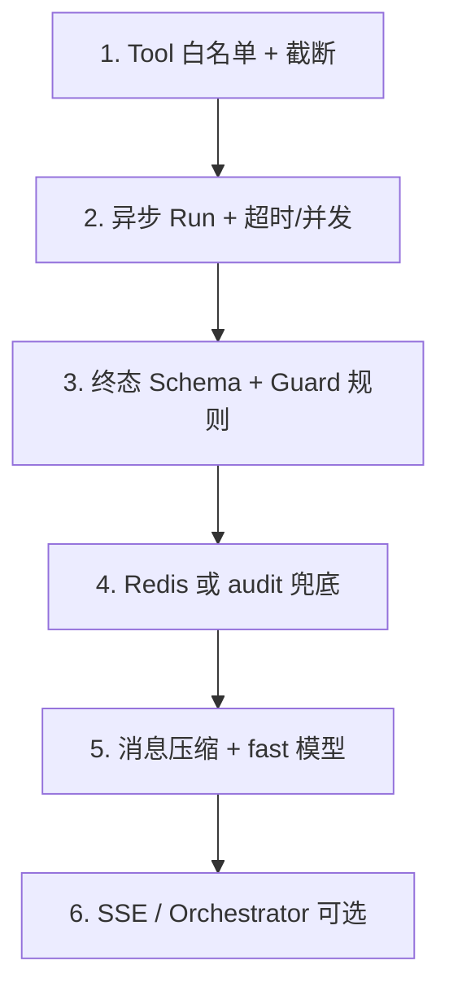

# Admin AI Agent 技术痛点与优化方案

**关联**：[设计方案 v2（痛点总表 §3）](./admin-ai-agent-design.md) | [现状能力](./admin-ai-capabilities.md) | [文档索引](./admin-ai-agent.md)

> **阅读顺序**：先看 [设计方案 §3 痛点—对策总表](./admin-ai-agent-design.md#31-痛点对策总表) 了解业务+技术全貌；本文是 Phase 0 **工程实施检查清单**（截断算法、Redis 字段、测试夹具等）。

本文档将 Agent 落地中的**技术坑**逐条对应到**可实施对策**与**代码落点**。

---

## 总原则（全局）

| # | 原则 | 说明 |
|---|------|------|
| 1 | Tool 白名单 | 模型不直连 SQL/HTTP；所有数据经 Nest Service |
| 2 | 终态 Schema | Zod / class-validator；非法则 fallback |
| 3 | 读多写少 | 写工具名 `propose_*` / `enqueue_*`；Apply 独立 API |
| 4 | 硬预算 | 步数、token、wall-clock、单 tool 超时 |
| 5 | 可追溯 | evidence 带 `ref` + `source: db` + `toolCallId` |

---

## 1. MiMo 多轮上下文膨胀

### 现象

- 6–8 步 tool 后 `messages` 体积大，费用与延迟上升，可能触达 context 上限。

### 对策

| 手段 | 实施要点 |
|------|----------|
| **工具结果截断** | `ToolRegistry.execute` 返回前统一 `truncateJson(result, maxChars=4000)`；scores≤5、signals≤8、供应商仅报价摘要 |
| **消息压缩** | `AgentRunner` 每步后 `compactMessages()`：保留 system + 首轮 user + 最近 2 轮 tool 对；更早的 tool_result 替换为 200 字代码摘要 |
| **步数上限** | Research MVP `maxSteps=6`；SeoOps `maxSteps=8` |
| **Token 预算** | 累计 usage 达 `maxTokens=12000` 时 system 注入「必须在本轮输出终态 JSON」 |
| **关闭 thinking** | 请求体固定 `thinking: { type: "disabled" }` |
| **模型分级** | 终态/report 用 `MIMO_MODEL_*` 主模型；Guard 用 `MIMO_MODEL_FAST` |

### 代码落点

- `api/src/ai/agent/tool-registry.ts` → `truncateToolResult()`  
- `api/src/ai/agent/agent-runner.ts` → `compactMessages()`  

### 验收

- 固定 fixture 跑 6 步后，请求体大小 < 80KB（监控日志）。  
- 单 Run token 有上限日志字段 `totalTokens`。

---

## 2. Token Plan / 官方 API 双端点混乱

### 现象

- Token Plan Key 在 `token-plan-cn.../anthropic` 可用，官方 `/v1/chat/completions` 返回 401。

### 对策

| 手段 | 实施要点 |
|------|----------|
| **职责分离** | **Agent 仅** `MIMO_ANTHROPIC_BASE_URL` + `/v1/messages`；`completeLlmJson` 可继续双协议 |
| **启动自检** | 可选 `AiHealthService.onModuleInit`：10 token ping；失败 `agentCapable=false` |
| **配置标志** | `AiConfigService` 解析结果增加 `capabilities: { agent: boolean }` |
| **运维脚本** | 已有 `npm run test:mimo`；CI nightly 可选 |
| **文档** | [external-config.md](./external-config.md) 区分两套 URL |

### 禁止

- 运行时自动在 Anthropic/OpenAI 端点间切换（难排查）。

### 代码落点

- `api/src/ai/llm-agent-turn.ts`（仅 Anthropic）  
- `api/scripts/test-mimo.mjs`  

---

## 3. 多实例 API 会话丢失（轮询 404）

### 现象

- `POST /runs` 在 pod A，`GET /runs/:id` 打到 pod B，内存 `Map` 无此 run。

### 对策

| 环境 | 方案 |
|------|------|
| dev 单进程 | `InMemoryAgentSessionStore` |
| 生产多副本 | `RedisAgentSessionStore`：`agent:run:{id}` JSON，TTL 3600s |
| 兜底 | Run `completed` 时写 `auditLog`；GET 先 Redis，miss 则读 audit 恢复 artifact |

### 数据结构（Redis）

```json
{
  "runId": "uuid",
  "status": "queued|running|completed|failed|cancelled",
  "agentType": "research",
  "step": 3,
  "maxSteps": 6,
  "lastTool": "list_candidate_scores",
  "artifact": null,
  "traceCompact": [],
  "createdAt": "ISO",
  "updatedAt": "ISO"
}
```

### 代码落点

- `api/src/ai/agent/agent-session.store.ts`（接口 + 两种实现）  
- `AgentRunner` 每步 `store.patch(runId, …)`  

### 验收

- 两实例模拟：POST 后 GET 另一实例仍能 `running`；完成后 audit 可恢复。

---

## 4. 模型幻觉（编造信号/分数）

### 现象

- 报告出现库中不存在的 GSC 涨幅、分数等。

### 对策

| 手段 | 实施要点 |
|------|----------|
| **Tool 出处** | 每条记录含 `source: "db:product_research_signal"`、`id`、`collectedAt` |
| **System 约束** | `evidence 只能引用 tool 返回；无数据须写「未采集」` |
| **空结果** | Tool 返回 `{ empty: true, reason: "no_signals" }` |
| **Guard 校验** | 终态 `evidence[].ref` 必须能映射到 `trace` 中某次 tool_result（解析失败 → `needsHumanReview`） |
| **UI 分离** | 并排展示 **规则分/规则 recommendedAction** 与 **AI 建议** |

### 代码落点

- `api/src/ai/agent/guard.service.ts` → `validateEvidenceRefs()`  
- Research 报告 DTO 含 `ruleRecommendedAction`（从 DB 只读 tool 填入上下文，非模型编造）

---

## 5. Agent 建议 vs 规则评分冲突

### 现象

- 规则 REJECT，Agent 写 APPROVE，运营不知信谁。

### 对策

| 手段 | 实施要点 |
|------|----------|
| **产品规则** | 转商品/正式 decision 仅人工 API |
| **报告字段** | `ruleRecommendedAction` + `aiSuggestedAction` + `disagreementReason` |
| **UI** | 不一致时黄色 banner |
| **禁止 Tool** | 无 `set_recommended_action`、`update_score` |

---

## 6. 长 Run 阻塞事件循环

### 现象

- Agent 跑 60s+，同进程其他请求变慢。

### 对策

| 手段 | 实施要点 |
|------|----------|
| **异步 Run** | Controller 立即 `{ runId }`；`setImmediate(() => runner.execute(runId))` |
| **并发上限** | 全局 `maxConcurrentAgentRuns=3`；超出 HTTP 429 + `retryAfter` |
| **Wall-clock** | 整 Run `AbortSignal.timeout(90_000)` |
| **单 tool** | `Promise.race(tool(), timeout(5000))` → `{ error: "tool_timeout" }` |

### 代码落点

- `api/src/ai/agent/agent.controller.ts`  
- `api/src/ai/agent/agent-runner.ts` → `Semaphore` 或简单 counter  

### 禁止

- 在 HTTP 请求生命周期内 `await runner.execute()` 全流程。

---

## 7. 测试难 / CI 不稳定

### 对策

| 层级 | 做法 |
|------|------|
| Tool 单测 | Mock Prisma / Service；断言输入输出 schema |
| Runner 集成 | Mock `fetch` 固定 Anthropic 序列（参考 `seo-automation.service.spec.ts`） |
| 契约测 | 终态 JSON Zod parse；失败走 fallback |
| Golden trace | `api/fixtures/agent/research-happy.json` |
| 真模型 | 仅 `npm run test:mimo` 或 nightly；不进 PR 必过 |

### 文件

- `api/src/ai/agent/agent-runner.spec.ts`  
- `api/src/ai/llm-json-completion.spec.ts`（已有）  

---

## 8. OpenAPI / 前后端契约漂移

### 对策

- `AgentModule` 注册进 `generate-openapi.ts` `include`。  
- 前端 `adminOpenApiFetch` + `lib/generated/admin-openapi.d.ts`。  
- CI：`npm run openapi:check`（已有 `scripts/check-openapi-drift.mjs`）。

---

## 9. 无 SSE 时 UX 像卡死

### 对策（MVP 不做 SSE）

| 手段 | 实施要点 |
|------|----------|
| 轮询 | 2s `GET /runs/:id` |
| 进度字段 | `step`, `maxSteps`, `lastTool`, `status` |
| 超时文案 | 45s 后提示可离开页面 |
| 完成通知 | 可选浏览器 Notification（Phase 2） |

### Phase 2 SSE

- 事件：`step_started`, `tool_finished`, `completed`  
- 不推 token 流（成本高、MiMo thinking 已关）

---

## 10. 合规 / 虚假宣传

### 对策

| 层级 | 规则示例 |
|------|----------|
| Guard 规则 | 禁止 `cure`, `FDA approved`, `#1 best`, `100% guaranteed`, 虚假 star rating |
| SEO | 禁止 fake review/stock/shipping；与 AGENTS.md 一致 |
| Apply 再检 | `POST /artifacts/:id/apply` 前再跑 Guard |
| change-log | 仅人工 Apply 写入（已有 SEO change-log 模式） |

### 代码落点

- `api/src/ai/agent/guard.service.ts` → `scanProhibitedClaims()`  

---

## 11. 依赖重型 Agent 框架

### 对策

坚持四件套，不引入 LangChain：

```text
agent-runner.ts
tool-registry.ts
agents/*.agent.ts
agent-session.store.ts
guard.service.ts
```

新 Agent = 新 `*.agent.ts` + 注册 tools 子集。

---

## 12. 实施优先级（检查清单）



| 阶段 | 必做项 | 上线门槛 |
|------|--------|----------|
| Phase 0 开发周 | 1 + 2 + 3 | 可内测 |
| 上生产（多副本） | 4 | 无 404 |
| 成本优化 | 5 | 按需 |
| 体验增强 | 6 | 可选 |

---

## 13. 与现有模块映射表

| 痛点 | 主要新增/修改文件 |
|------|-------------------|
| 上下文膨胀 | `agent-runner.ts`, `tool-registry.ts` |
| 双端点 | `llm-agent-turn.ts`, `ai-config.service.ts` |
| 会话 404 | `agent-session.store.ts` |
| 幻觉/冲突 | `guard.service.ts`, `tools/research.tools.ts`, 详情页 UI |
| 阻塞 | `agent.controller.ts` |
| 测试 | `*.spec.ts`, `fixtures/agent/` |
| 契约 | `agent.controller.ts`, OpenAPI 脚本 |
| UX | `admin-agent-report-panel.tsx` |

---

## 14. 监控与告警（建议）

| 指标 | 阈值建议 | 动作 |
|------|----------|------|
| `agent_run_failed_total` | 率 > 20% | 查 MiMo 额度/端点 |
| `agent_fallback_total` | 突增 | 查 schema/Guard |
| `agent_run_duration_p95` | > 75s | 降 maxSteps 或优化 tools |
| `agent_tool_timeout_total` | 单 tool 频发 | 优化 DB 查询/分页 |
| `agent_concurrent_rejected` | 持续 > 0 | 升并发或排队提示 |

日志字段：`runId`, `agentType`, `step`, `tool`, `inputTokens`, `outputTokens`, `requestId`。

---

## 15. 环境变量补充（Agent）

在 [external-config.md](./external-config.md) 中维护：

| 变量 | 用途 |
|------|------|
| `MIMO_ANTHROPIC_BASE_URL` | Agent **必需**（Token Plan） |
| `AGENT_MAX_STEPS` | 可选，默认 6 |
| `AGENT_MAX_CONCURRENT_RUNS` | 可选，默认 3 |
| `AGENT_SESSION_REDIS_URL` | 生产多副本 |
| `AGENT_RUN_TIMEOUT_MS` | 可选，默认 90000 |

---

## 16. 修订记录

| 日期 | 说明 |
|------|------|
| 2026-05-27 | 初版：设计评审结论与 Phase 0 实施清单 |
