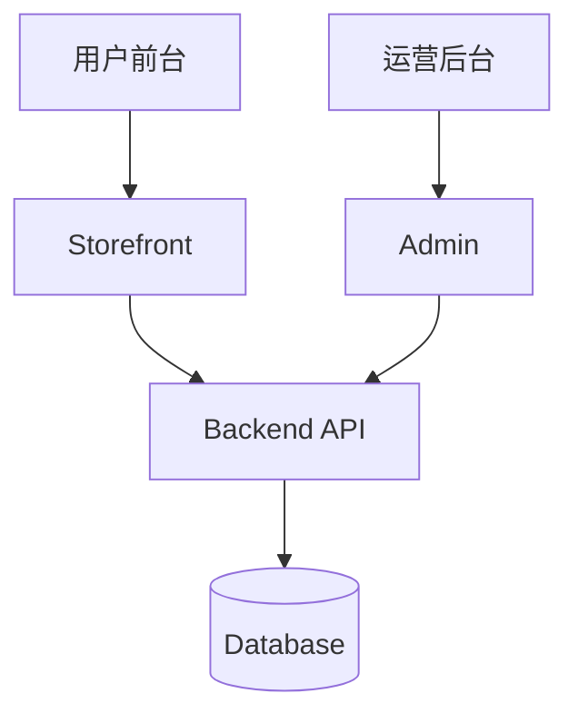
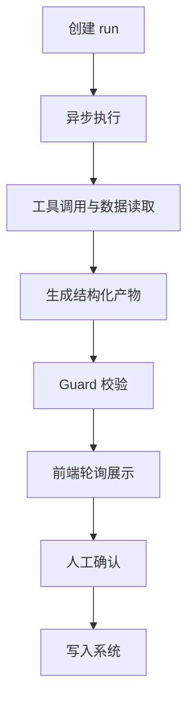

# 「AI+电商」：Multi-Agent 在独立站中的工程实践

> 本文只讲系统搭建与技术方法，弱化具体业务细节。  
> 下一篇：[痛点解决方案（技术版）](./02-admin-ai-agent-痛点解决方案.md)

## 一、问题背景（技术视角）

一个典型独立站通常包含三层：

- 前台 Web（用户访问）
- Admin Web（运营与配置）
- API + 数据层（业务逻辑与存储）

在这个架构下，AI 最适合先落在 **Admin 层**，因为这里有清晰流程、可审计、可回滚。



## 二、先有能力：单次补全（Fast Path）

第一阶段通常先做“单次调用 + 结构化输出”：

- 输入：固定 prompt + schema
- 输出：固定 JSON
- 优点：低延迟、低成本、易监控

这类能力适合：

- 批量生成草稿
- 单条文本润色
- 快速模板填充

## 三、为什么还需要 Agent（Slow Path）

单次补全的短板：

- 不擅长跨多数据源取证
- 不擅长多步推理与回合控制
- 不擅长“先生成提案、再人工确认写入”

因此需要 Agent 层来补：

```text
多源数据读取 → 证据化推理 → 结构化报告 → 人工确认写入
```

## 四、Multi-Agent 设计原则

### 1) 分层职责

- 规则引擎：给硬约束和准入标准
- Agent：做检索与建议
- 人：做最终确认

### 2) 专家拆分

不做“大一统 Agent”，而是按任务拆成多个专家：

- 分析类 Agent
- 优化类 Agent
- 文案类 Agent
- Guard Agent（合规与证据校验）

### 3) 快慢双路并存

- Fast Path：单次补全
- Slow Path：Agent 编排

两者并行，而不是互相替代。

## 五、一次 Agent Run 的标准流程



关键技术点：

- `POST /runs` 秒回，避免前端阻塞
- 每步可控：步数、token、超时、并发
- 结果可追溯：evidence + trace + audit
- 写入可控：Apply API 二次校验

## 六、工程风险（抽象版）

- 上下文膨胀：通过截断和消息压缩控制
- 多实例会话丢失：用 Redis 会话存储
- 幻觉：只允许引用 tool_result
- 误写入：写操作必须人工确认
- 契约漂移：OpenAPI + 类型生成

## 七、分阶段上线建议

| 阶段 | 目标 | 核心交付 |
|------|------|----------|
| Phase 0 | 跑通 Agent MVP | Runner、ToolRegistry、Guard、轮询 UI |
| Phase 1 | 可生产运行 | Redis 会话、OpenAPI 契约、监控告警 |
| Phase 2 | 体验增强 | SSE、更多专家 Agent、并行编排 |

## 八、三句话总结

1. Agent 不替代规则和人工，它补的是“多步取证与编排”。  
2. 技术上先做 Fast Path，再做 Slow Path，演进成本最低。  
3. 成功关键不是模型多强，而是流程可控、证据可追溯、写入可审计。
