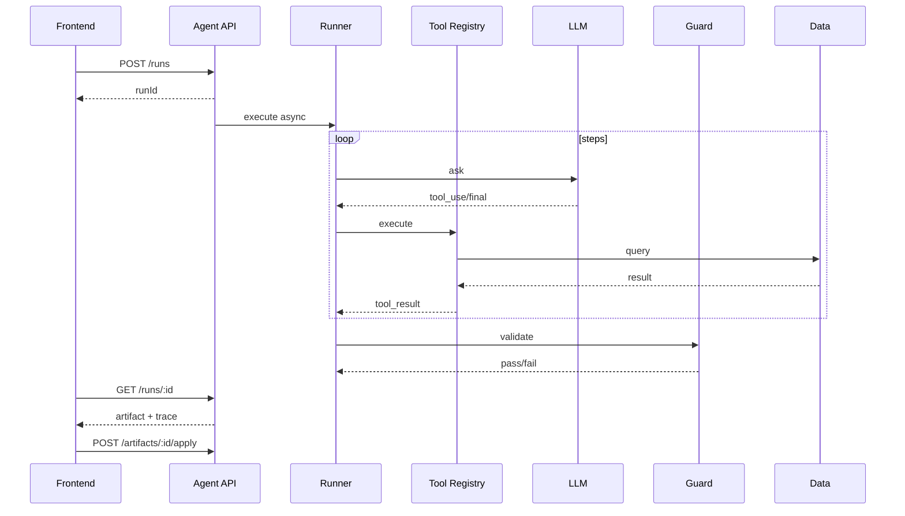

# 从痛点到方案：Multi-Agent 落地技术清单

> 本文是技术实施版，去除具体业务叙事，只保留可复用工程方法。

## 一、四条工程铁律

1. **Tool 白名单**：模型不直连数据库或外部系统。  
2. **终态 Schema**：所有产物必须可校验。  
3. **读多写少**：写入只走 Apply，并且人工确认。  
4. **硬预算**：步数、token、超时、并发必须有上限。

## 二、核心痛点与通用解法

| 痛点 | 解法 |
|------|------|
| 信息分散 | 用只读工具聚合数据，输出统一报告 |
| AI 与规则冲突 | 报告并排展示 rule vs ai，冲突显式标红 |
| 幻觉 | evidence 必须引用 tool_result |
| 误写入 | Apply 二次校验 + 审计日志 |
| 会话丢失 | Redis 持久化 run 状态 |
| 轮询卡死感 | 暴露 `step/maxSteps/lastTool` |
| 成本失控 | 截断、压缩、预算、快速模型分层 |

## 三、运行时参考配置

- `maxSteps`: 6~8
- `runTimeoutMs`: 90000
- `toolTimeoutMs`: 5000
- `maxConcurrentRuns`: 3
- `resultMaxChars`: 4000

## 四、标准执行链路

## 五、最小可用模块（MVP）

- `agent-runner.ts`
- `tool-registry.ts`
- `guard.service.ts`
- `agent-session.store.ts`（内存 + Redis）
- `agent.controller.ts`（create/get/cancel/apply）

## 六、可观测与质量门槛

建议最少覆盖以下指标：

- run 失败率
- run p95 时长
- tool 超时数
- fallback 次数
- 并发拒绝数

测试建议：

- Tool 层单测（mock service）
- Runner 集成测（mock LLM 响应）
- 契约测试（schema parse）
- 真模型测试放 nightly，不作为 PR 强制门槛

## 七、Phase 0 落地清单

1. 跑通 create/get/cancel/apply API  
2. 完成 Runner + Tool Registry + Guard  
3. 支持前端轮询进度  
4. 增加审计日志  
5. 完成至少 1 条端到端集成测试

## 八、结论

Multi-Agent 落地本质是一个 **可控编排系统**，不是“接入一个更强模型”。  
真正决定上线质量的是：**边界、预算、证据、审计**。
