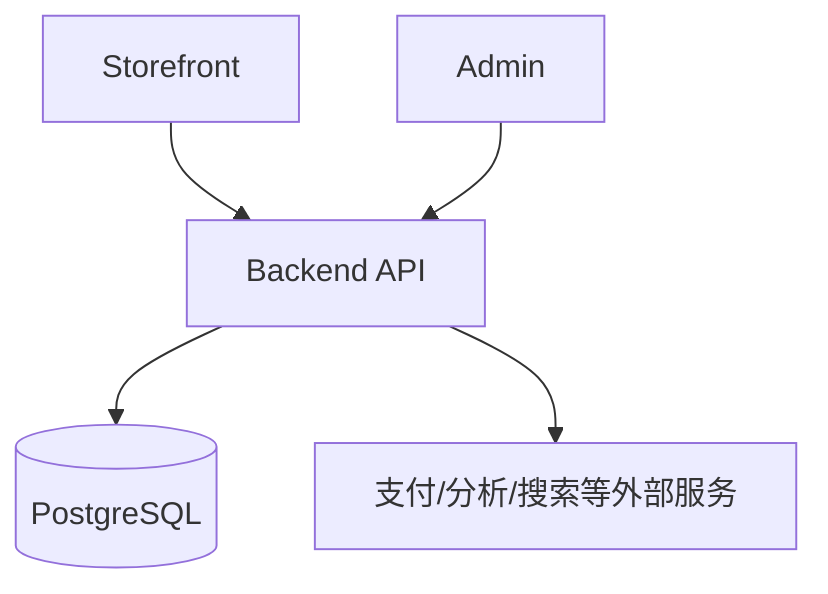

# 从 0 到 1：独立站系统搭建的技术路线（实录版）

> 这篇只聊一件事：一个独立站系统，怎么从“能演示”一步步做到“能稳定跑业务”。

很多项目一上来就想把功能堆满，结果往往是：前台看着热闹，后端不稳，支付没闭环，后面改一处牵一片。

这篇给你一条更稳的路线：先把主链路打通，再加自动化和智能化。你可以把它当成一份“搭站顺序建议”，按阶段照着落地。

## 一、总路线

```text
前台原型 → API 与数据库 → 支付闭环 → SEO 基础设施 → Admin 中台 → 自动化模块 → 工程化加固
```

---

## 二、阶段 1：先把前台原型跑起来

先别急着上复杂后端，第一步是让人“看得到、点得动”。

**这一阶段要做什么：**

- 搭 Next.js 页面骨架
- 做商品列表/详情/购物车的基础交互
- 用本地 mock 数据把页面先喂起来

**这一阶段的目标：**

- 信息架构先跑通
- 关键交互先验证
- UI 可以快速试错

一句话：先把“壳子”做对，后面接真数据才不会返工。

---

## 三、阶段 2：接入 API 和数据库

原型能跑后，马上进入“真系统”阶段：把数据和逻辑从前端拆出去。

**核心动作：**

- 用 NestJS 搭模块化 API
- 用 Prisma 建模 + 迁移数据库
- 前台从本地数据切到 API 数据

**阶段结果：**

你会得到一个稳定三角：`Web + API + DB`。  
从这一步开始，系统才真正具备扩展能力。

---

## 四、阶段 3：打通支付和订单闭环

这一步是分水岭。没有支付闭环，站点本质还是“展示站”。

**关键链路：**

- 下单前校验
- 跳转 Stripe Checkout
- Webhook 回写订单状态
- 支付成功后变更库存

**为什么要优先做这步：**

- 交易闭环是业务主链
- 后续运营、自动化、AI 都依赖这条主链

一句话：先能稳定“收钱+记账+扣库存”，再谈增长和智能。

---

## 五、阶段 4：把 SEO 做成基础设施

SEO 最怕“上线后补课”。正确姿势是：当基础设施做。

**技术动作：**

- metadata / canonical / OG 规范化
- sitemap 与 robots
- JSON-LD 结构化数据
- URL 与索引策略统一

**阶段结果：**

SEO 变成默认能力，不再靠后期救火。

---

## 六、阶段 5：建设 Admin 中台

前台能卖、后端能跑后，就该让运营“自己能操作”。

**这阶段建议优先级：**

1. 认证与角色权限
2. 订单与库存运营
3. 内容管理
4. 配置中心与审计日志

**阶段结果：**

从“改代码才能改业务”，升级成“后台可运营、可留痕”。

---

## 七、阶段 6：加入自动化和 AI 辅助

到这一步再上自动化，节奏就对了。

**原则很简单：**

- 自动化负责“提建议、出草稿”
- 人工负责“确认、发布、写入”

**推荐做法：**

- 自动扫描 + 草稿生成
- AI 用于改写和辅助，不直接改线上
- Apply / Publish 保留人工确认
- 失败要可回退（mock-safe / fallback）

**阶段结果：**

效率上去了，但系统仍然可控。

---

## 八、阶段 7：工程化加固

系统“能用”之后，下一步是“能长期维护”。

**加固清单：**

- OpenAPI 契约生成
- 类型化客户端
- 监控指标与日志
- 队列与并发控制
- 国际化与文档体系

**阶段结果：**

研发效率、协作效率、线上稳定性三件事一起提升。

---

## 九、技术分层图



---

## 十、0→1 常见误区

这些坑很常见，提前避开能省很多时间：

- 先做复杂自动化，最后才补交易闭环
- 前后端没契约，靠口头同步字段
- AI 直接写线上，不留人工确认
- 没有审计与回溯能力
- 多实例部署前，不处理会话一致性

---

## 十一、可复用经验

1. **先闭环，再增强**：先把交易和数据主链打通。  
2. **先约束，再智能**：规则、权限、审计先立住。  
3. **先标准化，再扩展**：契约、类型、监控先上，再加复杂能力。

---

## 十二、一句话总结

0→1 不是“堆功能比赛”，而是按依赖关系一层层搭：

```text
可演示 → 可联动 → 可交易 → 可运营 → 可自动化 → 可长期维护
```
