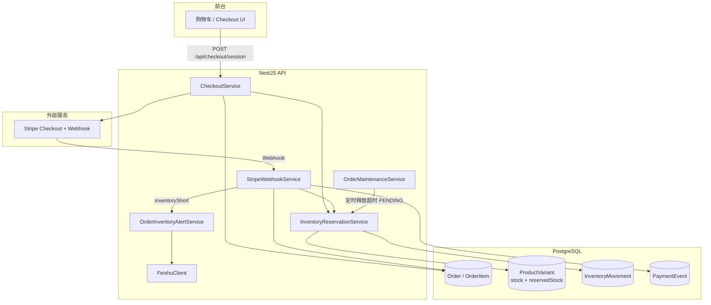
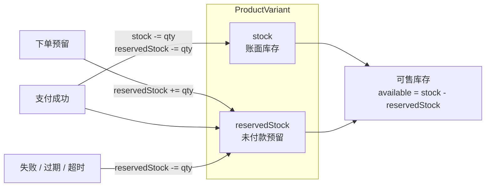
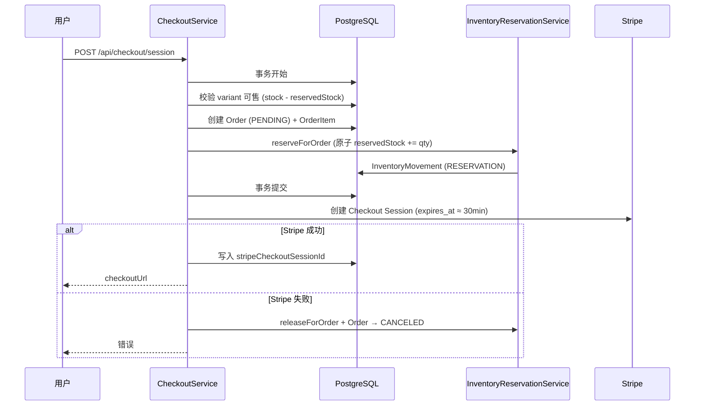
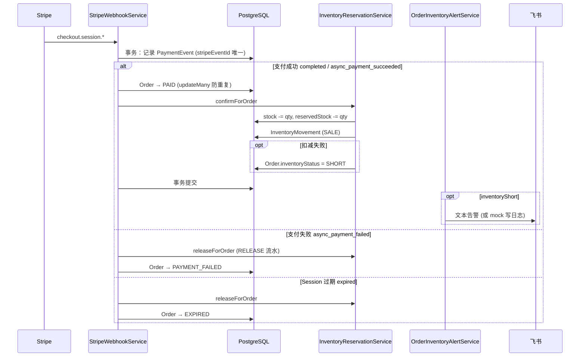
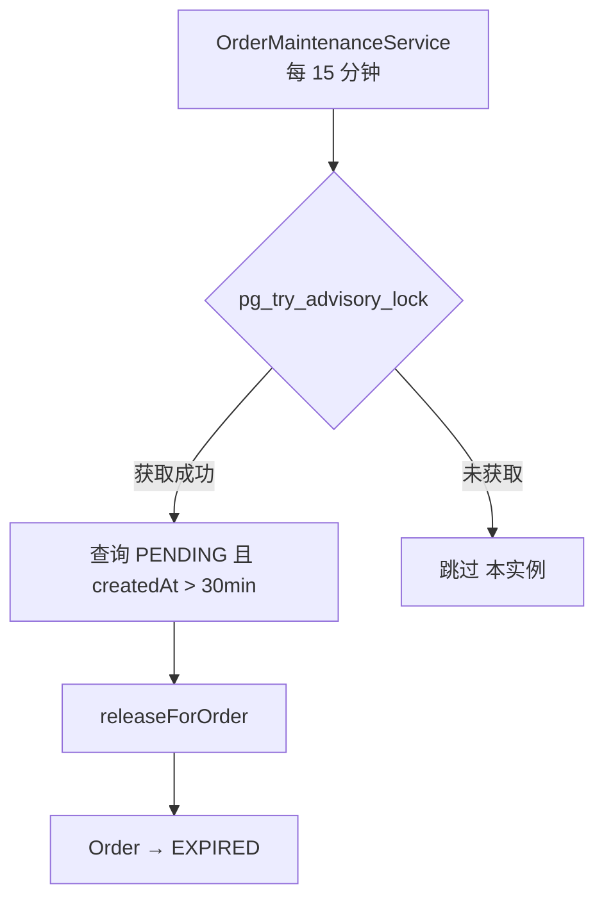
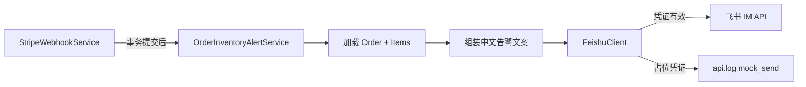

# 订单支付与库存优化方案

本文档说明 PulseGear 当前 **下单 → Stripe 支付 → 库存预留/确认 → 异常告警** 的实现方式，对应代码已落地（方案 A：`reservedStock` 预留库存）。

相关配置见 [external-config.md](./external-config.md)（Stripe、飞书告警）。

---

## 1. 背景与问题

### 1.1 优化前链路

```
用户下单 → 仅校验 stock → 创建 PENDING 订单 → Stripe 支付
         → Webhook 成功后才 stock -= qty
```

### 1.2 主要风险

| 风险 | 说明 |
|------|------|
| **超卖** | 下单只读库存、不占用；多人并发可通过校验，支付回调时集中扣减 |
| **脏 PENDING 订单** | 先写订单再调 Stripe；Stripe 失败会留下无 Session 的挂单 |
| **可售库存失真** | 支付完成到 Webhook 之间，前台仍显示「未扣减」库存 |
| **负库存** | Webhook 内无条件 `decrement`，极端情况下 `stock` 可为负 |
| **已付款缺货无闭环** | 钱已收但扣库失败时，缺少状态标记与运营通知 |

---

## 2. 优化目标

1. **防超卖**：下单阶段原子占用可售库存（预留）。
2. **状态一致**：`可售 = stock - reservedStock`，前后台、Feed 统一口径。
3. **失败可恢复**：支付失败/Session 过期/超时未付 → 释放预留。
4. **幂等与可审计**：支付事件、库存流水可去重、可追溯。
5. **异常可运营**：已付款但库存确认失败 → `SHORT` + 飞书告警。

---

## 3. 方案选型：方案 A（`reservedStock`）

| 维度 | 方案 A（已采用） | 方案 B（未采用） |
|------|------------------|------------------|
| 数据模型 | `stock`（账面）+ `reservedStock`（未付占用） | 下单直接减 `stock` |
| 可售库存 | `stock - reservedStock` | 等于 `stock` |
| 支付成功 | `stock↓` 且 `reservedStock↓` |  mostly 改订单状态 |
| 运营可读性 | 可区分「在库 / 已预留」 | 需靠流水解释 |

---

## 4. 系统架构

### 4.1 模块总览



### 4.2 库存数据语义



---

## 5. 核心流程

### 5.1 创建 Checkout Session（下单 + 预留）



**要点**

- 预留与建单在同一数据库事务内完成；按 `variantId` 排序更新，降低死锁概率。
- 预留条件：`reservedStock + quantity <= stock`（SQL 原子更新）。
- Stripe Session 过期时间与预留 TTL 对齐（约 30 分钟）。

### 5.2 Stripe Webhook（支付结果）



**要点**

- `PaymentEvent.stripeEventId` 唯一 → Webhook 幂等。
- `Order.updateMany(where status != PAID)` → 避免重复处理支付成功。
- `InventoryMovement` 唯一约束 `(orderId, variantId, type)` → 流水幂等。
- 无预留的历史订单：`confirmForOrder` 回退为直接扣 `stock`（兼容旧数据）。

### 5.3 超时 PENDING 清理



---

## 6. 优化点对照表

| # | 优化点 | 实现位置 | 效果 |
|---|--------|----------|------|
| 1 | 下单预留 `reservedStock` | `InventoryReservationService.reserveForOrder` | 防超卖 |
| 2 | 可售库存统一计算 | `inventory-policy.getAvailableStock` | 前台/Feed/低库存告警一致 |
| 3 | 支付成功确认扣减 | `confirmForOrder` | 预留转实扣，非盲 decrement |
| 4 | 失败/过期释放 | Webhook + `releaseForOrder` | 避免预留泄漏 |
| 5 | Stripe 失败补偿 | `CheckoutService.cancelPendingOrder` | 减少脏 PENDING |
| 6 | Session 与 TTL 对齐 | `checkoutExpiresAt` + `PENDING_ORDER_TTL_MS` | 减少长时间占库 |
| 7 | 定时过期任务 | `OrderMaintenanceService` | 兜底释放 |
| 8 | 缺货已付款标记 | `Order.inventoryStatus = SHORT` | 可筛选、可运营 |
| 9 | 飞书告警 | `OrderInventoryAlertService` | SHORT 订单通知运营 |
| 10 | Webhook 原始 body | `main.ts` + 签名校验 | 安全与正确解析 |

---

## 7. 数据模型变更

迁移：`api/prisma/migrations/0016_inventory_reservation/`

| 模型/字段 | 说明 |
|-----------|------|
| `ProductVariant.reservedStock` | 未付款订单占用数量，默认 0 |
| `InventoryMovementType.RESERVATION` | 预留流水（quantity 为正） |
| `InventoryMovementType.RELEASE` | 释放流水 |
| `Order.inventoryStatus` | `OK` \| `SHORT` |
| `InventoryMovement @@unique([orderId, variantId, type])` | 流水幂等 |

### 7.1 单笔订单库存变化示例

初始：`stock = 10`, `reservedStock = 0`, 可售 = 10

| 阶段 | stock | reservedStock | 可售 |
|------|-------|---------------|------|
| 下单预留 2 件 | 10 | 2 | 8 |
| 支付成功 | 8 | 0 | 8 |
| 若过期未付（释放） | 10 | 0 | 10 |

---

## 8. 飞书告警（SHORT 订单）

### 8.1 触发条件

Webhook 支付成功且 `confirmForOrder` 判定 `inventoryShort === true`（已标记 `Order.inventoryStatus = SHORT`）。

### 8.2 配置

```env
FEISHU_ALERT_ENABLED=true
FEISHU_APP_ID="cli_replace_me"
FEISHU_APP_SECRET="replace_me"
FEISHU_ALERT_CHAT_ID="oc_replace_me"
```

占位凭证时进入 **mock 模式**：不写飞书 API，在 `logs/api.log` 记录 `feishu.mock_send` 预览。

### 8.3 告警流程



告警内容包含：订单号、金额、SKU 明细、后台处理链接 `/admin/orders/{id}`。

---

## 9. 关键代码索引

| 职责 | 路径 |
|------|------|
| 下单与预留 | `api/src/checkout/checkout.service.ts` |
| 预留/确认/释放 | `api/src/inventory/inventory-reservation.service.ts` |
| 可售库存策略 | `api/src/admin-products/inventory-policy.ts` |
| Stripe Webhook | `api/src/webhooks/stripe-webhook.service.ts` |
| 超时清理 | `api/src/orders/order-maintenance.service.ts` |
| 支付补偿回查 | `api/src/orders/order-payment-reconcile.service.ts` |
| 预留库存对账 | `api/src/inventory/inventory-reconcile.service.ts` |
| 飞书客户端 | `api/src/notifications/feishu/feishu.client.ts` |
| SHORT 告警 | `api/src/notifications/order-inventory-alert.service.ts` |
| Schema | `api/prisma/schema.prisma` |

---

## 10. 部署与迁移

```bash
cd api
npm run prisma:migrate   # 应用 0016_inventory_reservation
# 配置 .env 中 Stripe、飞书变量后重启 API
```

---

## 11. 风险治理路线图（持续优化）

### 11.1 已落地

| 项 | 状态 | 说明 |
|----|------|------|
| 预留库存 + 可售口径统一 | ✅ | 通过 `reservedStock` 避免超卖 |
| 支付成功确认扣减 / 失败释放 | ✅ | 防止负库存与预留泄漏 |
| PENDING 超时释放任务 | ✅ | `OrderMaintenanceService` 定时过期 |
| SHORT 告警（飞书） | ✅ | 支付成功但确认失败可通知运营 |
| 支付主动补偿回查 | ✅ | `OrderPaymentReconcileService` 定时回查 Stripe Session，兜底 webhook 延迟/丢失 |
| 预留库存对账修正 | ✅ | `InventoryReconcileService` 定时核对 `reservedStock` 与流水净额并自动修正 |
| 对账异常飞书告警 | ✅ | 对账修正后通过 `OrderInventoryAlertService` 发送漂移告警 |
| 通知 Outbox + 自动重试 | ✅ | `NotificationOutbox` 持久化告警，`NotificationDispatcherService` 定时发送与指数退避 |
| 运营健康指标聚合 | ✅ | Dashboard 增加 `pendingOver30m`、`shortOrders`、`webhookSuccessRate24h` 三项 |

### 11.2 待落地（建议优先级）

1. 后台「SHORT 订单」专用列表与处理状态（退款/补货/改发）。
2. 对账异常自动建工单 / 人工处理状态闭环（当前仅告警）。
4. Prometheus 指标：`order.pending.over_30m`、`inventory.short.count`、`webhook.process.success_rate`。
5. PgBouncer + 连接池调优（高并发场景）。

---

## 12. 相关文档

- [external-config.md](./external-config.md) — 环境变量（Stripe、飞书）
- [README.md](../README.md) — 本地 Webhook 调试说明
